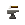

# Tinkers Construct Materials Guide 

> A web app designed to make Tinkers' Tool Designing Easy!

I'm developing this web app to make designing Tinkers' tools easier for myself and for anyone else who wants to use it. This tool will allow users to quickly browse, compare, and plan out their custom tools for various versions of Tinkers' Construct.

### CURRENTLY IN DEVELOPMENT

My first build will be based on Tinkers' 1.12.2, with Tinker Alloying Addon, and primarily based on the MC Eternal modpack. Eventually, I will add support for other versions and try to add as many materials as I can find supported by Tinkers.

### PLANNED FEATURES
- [X] **Materials List**: A sortable and searchable list of materials for different versions.
  - [X] Filter by durability, mining speed, attack damage, and other stats.
  - [X] Search by name, mod, or modifiers.
  - [ ] Fix minor css bugs
- [X] **Modifiers List**: View modifiers available for each material and see how they affect tool performance.
  - [X] Search for key words in descriptions or by name
  - [ ] Improve design to be more intuitive
- [X] **Tool Builder**: A comprehensive tool-building UI to let users test various tool combinations.
  - [X] Ability to build tools and compare them
    - [X] Support for standard tools and weapons
    - [X] Support for Shuriken
    - [ ] Support for Bows
    - [ ] Support for Laserguns
  - [X] Updated stats in real-time based on material selection
  - [ ] Image generation to display tool image in real-time!
  - [ ] Improved compare features
- [ ] **Multi-version support**: Select your Minecraft version for up-to-date materials and algorithms!
- [X] **Modpack support**: Ability to choose if you're playing on a modpack with changed materials!
  - [ ] MCEternal
  - [ ] TBD (Please suggest modpacks in issues!)
- [X] **Dark Mode Only**: For the cultured.
- [ ] **Mobile-friendly design**: Fully responsive UI for use on phones and tablets.

### FAQ

#### How do I add a new mod or material?
You can contribute by adding new materials or mods through our community contribution system. Follow these steps:
1. Go to the [Issue Tracker](https://github.com/your-repo/issues).
2. Open a new issue and select the "material" label.
3. Provide details on the mod/material you'd like to see added.
4. Our team (just me X.X) will review the request and add it in a future update!

#### How do I build a tool?
Once you've selected the version you're working with, navigate to the "Tool Builder" tab. Here you can select a tool, the materials you want to use, and the "Build Tool" button to build it!

#### I found a bug. How can I report it?
Head over to the [Issue Tracker](https://github.com/your-repo/issues) and open a new issue. Make sure to use the "bug" label so I can prioritize fixing it!

### DONATIONS

If you find this tool useful and want to support its continued development, consider donating!

- [Donate via PayPal](https://www.paypal.com/donate/?business=C9CAJFYWQXR9C&no_recurring=0&item_name=Support+me+and+this+project+directly+if+you+have+the+extra+cash%21&currency_code=USD)
- [Support us on Patreon](https://www.patreon.com/moshirmoshir)

Thank you for your support!
